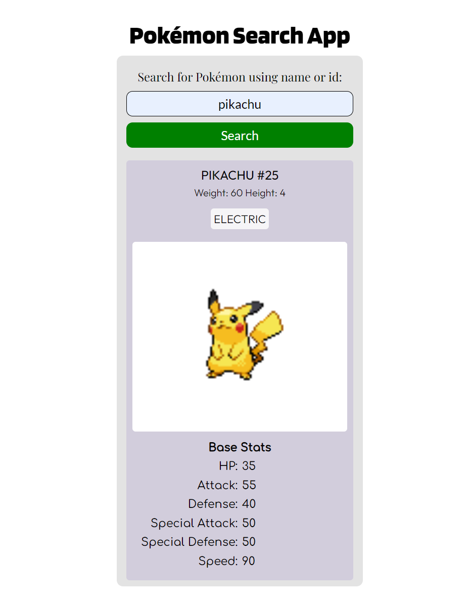

# Pokemon Search App
 A simple program page that searches for a pokemon using name or id, and show some more info about it, made for FreeCodeCamp certification Project using HTML, CSS and JavaScript

 Open index.html to view or use the app, it only needs a browser. Search for a specific pokemon using a name or a number for index and a description and picture of the pokemon will appear. 

## Page Preview
 